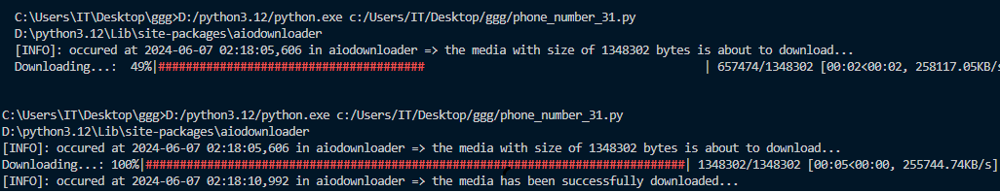

# aiodownloader

### An async library to download videos, photos, musics and files.

- ### Easy to use and fast to download.

- ### Github repository: https://github.com/Alirezagrs/aiodownloader


# Getting Started

### To Install aiodownloader, simply do
    pip install aiodownloader

### because of aiodownloader has a light sqlite server besides, the next step is:
    alembic init migrations
___
```go to alembic.ini```
```ini
sqlalchemy.url = sqlite:///app.db
```
___

```go to migrations/env.py```
```python
from aiodownloader.models.app_model import Base 

target_metadata = Base.metadata
```
___
### get back to terminal and make commands done.
    alembic revision --autogenerate
    alembic upgrade head

### Now enjoy aiodownloader ;) 
# Examples

```python
import asyncio

from aiodownloader import Download, 
download_multi_media

async def main():
    # download a video or music
    await Download(
        url="https://www.namasha.com/videos--144p.mp4",
        quality=144,
        status_bar=True, # default is False
    ).recognizer()

    # download a photo
    await Download(
        url="https://www.namasha.com/photos.jpg"
        ).recognizer()

asyncio.run(main())
```
___

```python
async def main():
    await download_multi_media(
        'url',
        'url',
        'url',
        .
        .
        .
    )
asyncio.run(main())
```
### output sample of download a video.


## Extra

### if you want to know where your downloads location is in your system:

```python
from aiodownloader.constances import BASE_DIR
print(BASE_DIR)

# you can change it by editing BASE_DIR from source code

```
### if you want to know about your download status:
```python
from aiodownloder.models.app_model import read

read()

```
